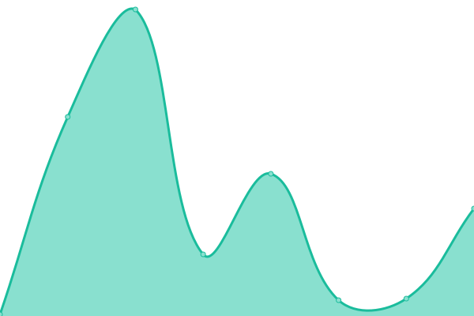

# [📈 Live Status](https://status.lizardbyte.dev): <!--live status--> **🟩 All systems operational**

This repository contains the open-source uptime monitor and status page for [LizardByte](https://app.lizardbyte.dev), powered by [Upptime](https://github.com/upptime/upptime).

With [Upptime](https://upptime.js.org), you can get your own unlimited and free uptime monitor and status page, powered entirely by a GitHub repository. We use [Issues](https://github.com/LizardByte-bot/upptime/issues) as incident reports, [Actions](https://github.com/LizardByte-bot/upptime/actions) as uptime monitors, and [Pages](https://status.lizardbyte.dev) for the status page.

<!--start: status pages-->
<!-- This summary is generated by Upptime (https://github.com/upptime/upptime) -->
<!-- Do not edit this manually, your changes will be overwritten -->
<!-- prettier-ignore -->
| URL | Status | History | Response Time | Uptime |
| --- | ------ | ------- | ------------- | ------ |
|  [Crowdin](https://translate.lizardbyte.dev) | 🟩 Up | [crowdin.yml](https://github.com/LizardByte-infrastructure/upptime/commits/HEAD/history/crowdin.yml) | 

 751ms
     
 | 

<a href="https://status.lizardbyte.dev/history/crowdin">100.00%</a>
    

|  [Developer Dashboard](https://app.lizardbyte.dev/dashboard) | 🟩 Up | [developer-dashboard.yml](https://github.com/LizardByte-infrastructure/upptime/commits/HEAD/history/developer-dashboard.yml) | 

 487ms
     
 | 

<a href="https://status.lizardbyte.dev/history/developer-dashboard">100.00%</a>
    

|  Discord bot | 🟩 Up | [discord-bot.yml](https://github.com/LizardByte-infrastructure/upptime/commits/HEAD/history/discord-bot.yml) | 

 2200ms
     
 | 

<a href="https://status.lizardbyte.dev/history/discord-bot">84.05%</a>
    

|  [Docs](https://docs.lizardbyte.dev) | 🟩 Up | [docs.yml](https://github.com/LizardByte-infrastructure/upptime/commits/HEAD/history/docs.yml) | 

 402ms
     
 | 

<a href="https://status.lizardbyte.dev/history/docs">100.00%</a>
    

|  [GameDB](https://app.lizardbyte.dev/GameDB) | 🟩 Up | [game-db.yml](https://github.com/LizardByte-infrastructure/upptime/commits/HEAD/history/game-db.yml) | 

 159ms
     
 | 

<a href="https://status.lizardbyte.dev/history/game-db">100.00%</a>
    

|  [uno](https://app.lizardbyte.dev/uno) | 🟩 Up | [uno.yml](https://github.com/LizardByte-infrastructure/upptime/commits/HEAD/history/uno.yml) | 

 156ms
     
 | 

<a href="https://status.lizardbyte.dev/history/uno">100.00%</a>
    

|  [Website](https://app.lizardbyte.dev) | 🟩 Up | [website.yml](https://github.com/LizardByte-infrastructure/upptime/commits/HEAD/history/website.yml) | 

 76ms
     
 | 

<a href="https://status.lizardbyte.dev/history/website">100.00%</a>
    

<!--end: status pages-->

[**Visit our status website →**](https://status.lizardbyte.dev)

## 📄 License

- Powered by: [Upptime](https://github.com/upptime/upptime)
- Code: [MIT](./LICENSE) © [LizardByte-bot](https://app.lizardbyte.dev)
- Data in the `./history` directory: [Open Database License](https://opendatacommons.org/licenses/odbl/1-0/)
